# Data Flow Architecture - NextJS Stripe Payment Template

## 1. Core Data Flows

### 1.1 User Authentication Flow

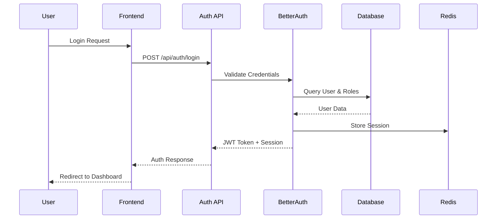

### 1.2 Product Purchase Flow (One-time Payment)

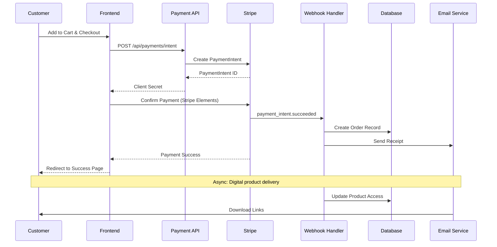

### 1.3 Subscription Management Flow

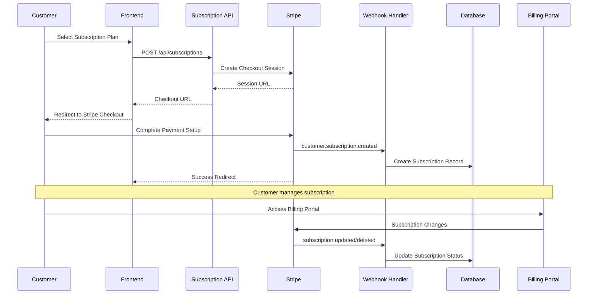

### 1.4 Admin Analytics Data Flow

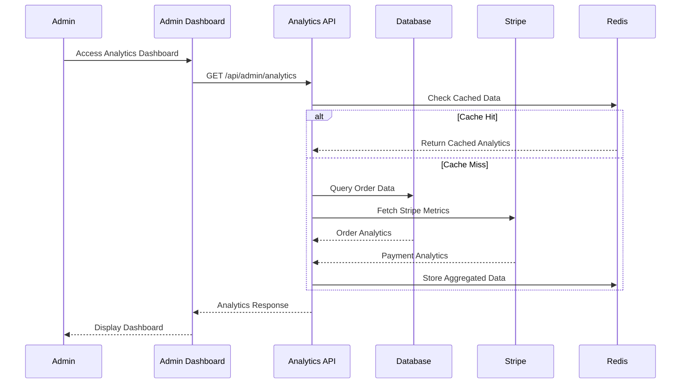

## 2. Payment Processing Flows

### 2.1 Checkout Process Data Flow

```
Customer Cart → Payment Intent → Stripe Elements → Payment Confirmation → Webhook Processing → Order Fulfillment

Detailed Steps:
1. Customer adds products to cart (stored in localStorage/session)
2. Customer proceeds to checkout
3. Frontend creates PaymentIntent via API
4. Stripe Elements securely collects payment details
5. Payment is processed by Stripe
6. Webhook confirms payment success
7. Order is created in database
8. Digital products are made available
9. Confirmation email is sent
10. Customer is redirected to success page
```

### 2.2 Subscription Lifecycle Data Flow

```
Plan Selection → Stripe Checkout → Subscription Creation → Recurring Billing → Status Updates

Key Events:
- customer.subscription.created: Initial subscription setup
- invoice.payment_succeeded: Successful recurring payment
- invoice.payment_failed: Failed payment (dunning management)
- customer.subscription.updated: Plan changes, quantity updates
- customer.subscription.deleted: Cancellation
- customer.subscription.paused: Temporary pause (if enabled)
```

### 2.3 Tax Calculation Flow

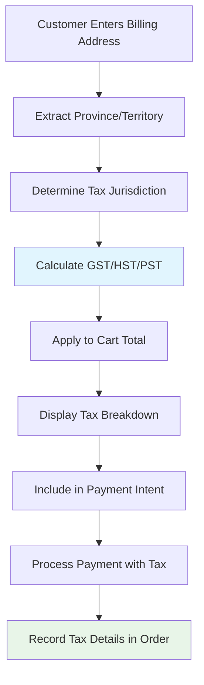

## 3. User Role-Based Data Access

### 3.1 Role Permission Matrix

```
┌─────────────────┬─────────┬──────────┬──────────┐
│ Resource/Action │  Admin  │ Customer │ Support  │
├─────────────────┼─────────┼──────────┼──────────┤
│ Product CRUD    │   ✅    │    ❌     │    👁️    │
│ Order Management│   ✅    │   Own    │    ✅     │
│ Customer Data   │   ✅    │   Own    │    ✅     │
│ Analytics       │   ✅    │    ❌     │ Limited  │
│ Subscriptions   │   ✅    │   Own    │    ✅     │
│ Refunds         │   ✅    │    ❌     │    ✅     │
│ Promo Codes     │   ✅    │    ❌     │    👁️    │
│ System Settings │   ✅    │    ❌     │    ❌     │
└─────────────────┴─────────┴──────────┴──────────┘

Legend: ✅ Full Access | 👁️ Read Only | ❌ No Access | Own = Own Data Only
```

### 3.2 Data Access Control Flow

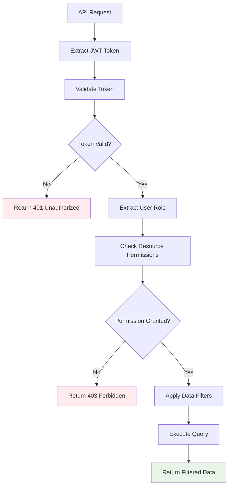

## 4. Webhook Event Processing

### 4.1 Stripe Webhook Handler Flow

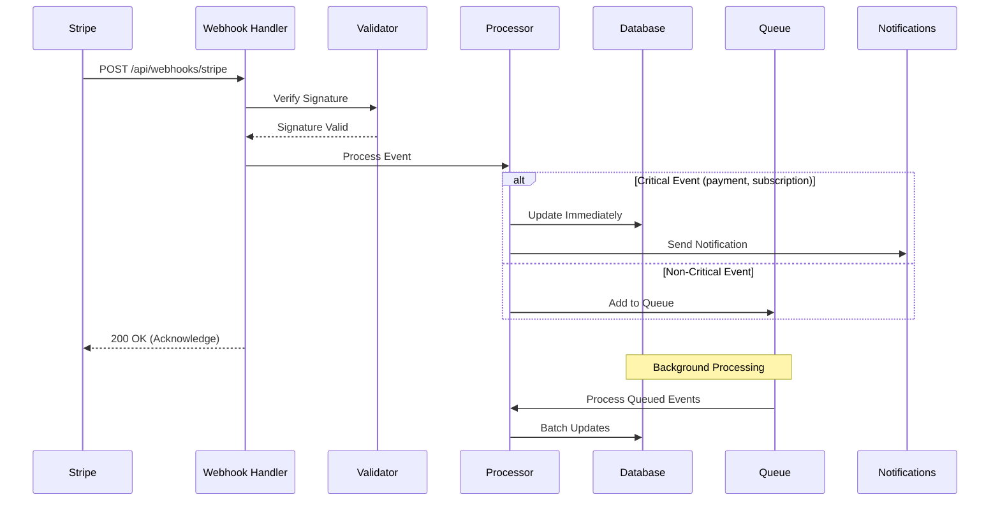

### 4.2 Event Processing Priority

```
High Priority (Immediate Processing):
- payment_intent.succeeded
- payment_intent.payment_failed  
- customer.subscription.created
- customer.subscription.deleted
- invoice.payment_succeeded
- invoice.payment_failed

Medium Priority (Queue Processing):
- customer.updated
- payment_method.attached
- setup_intent.succeeded

Low Priority (Batch Processing):
- customer.discount.created
- coupon.created
- product.updated
```

## 5. Caching Strategy and Data Flow

### 5.1 Multi-Layer Caching Architecture

```
Browser Cache (Client-Side)
├── Static Assets (Images, CSS, JS)
├── API Response Cache (SWR/React Query)
└── Page Cache (Next.js)

Application Cache (Server-Side)
├── Redis Session Store
├── Rate Limiting Counters
├── Analytics Data Cache
└── Product Catalog Cache

Database Query Cache
├── Connection Pool
├── Query Result Cache
└── Read Replica Routing
```

### 5.2 Cache Invalidation Flow

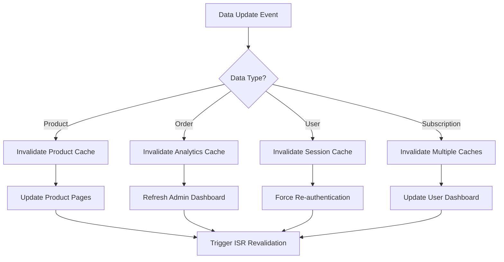

## 6. Error Handling and Data Consistency

### 6.1 Error Recovery Flow

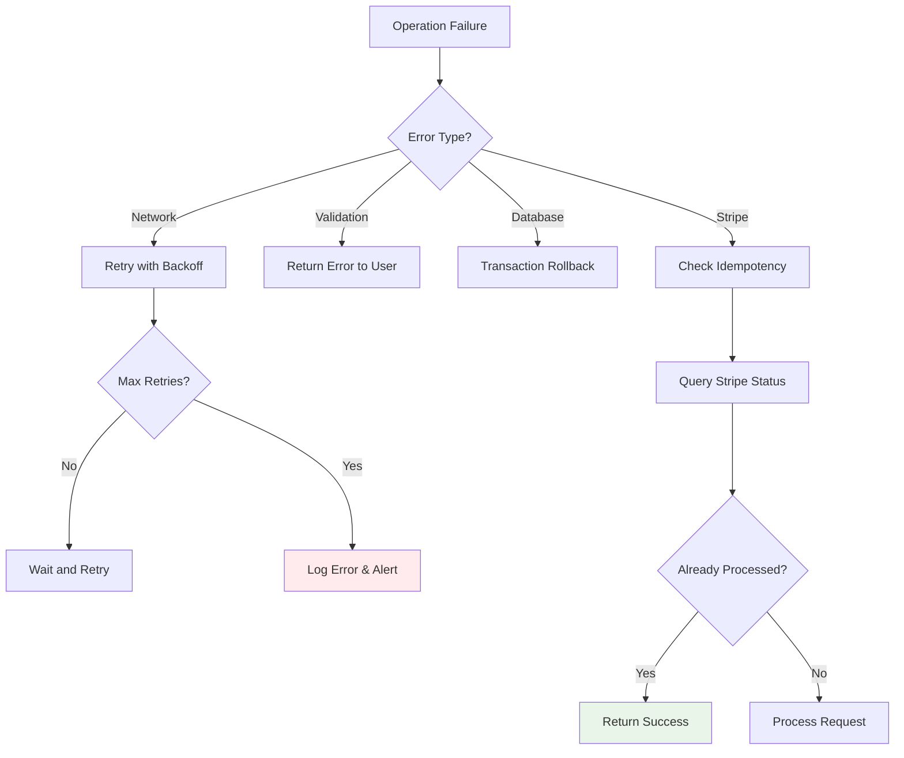

### 6.2 Data Consistency Patterns

1. **Eventual Consistency**: Webhook processing ensures eventual consistency between Stripe and local database
2. **Idempotency**: All payment operations use idempotency keys to prevent duplicate processing
3. **Compensating Actions**: Failed operations trigger compensating actions to maintain consistency
4. **Audit Trail**: All critical operations are logged for compliance and debugging

## 7. Real-time Data Updates

### 7.1 Server-Sent Events (SSE) for Admin Dashboard

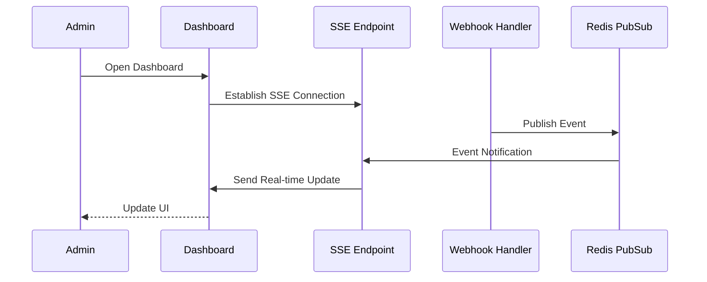

### 7.2 WebSocket for Customer Notifications

```
Customer Payment Status Updates:
- Payment processing
- Payment confirmed
- Subscription renewed
- Download available
```

## 8. Data Migration and Backup Flows

### 8.1 Database Backup Strategy

```
Daily Automated Backups:
├── Full Database Backup (02:00 UTC)
├── Transaction Log Backup (Every 15 minutes)
├── Point-in-Time Recovery Setup
└── Cross-Region Backup Replication

Backup Verification:
├── Automated Restore Testing (Weekly)
├── Backup Integrity Checks (Daily)
└── Recovery Time Testing (Monthly)
```

### 8.2 Data Migration Flow

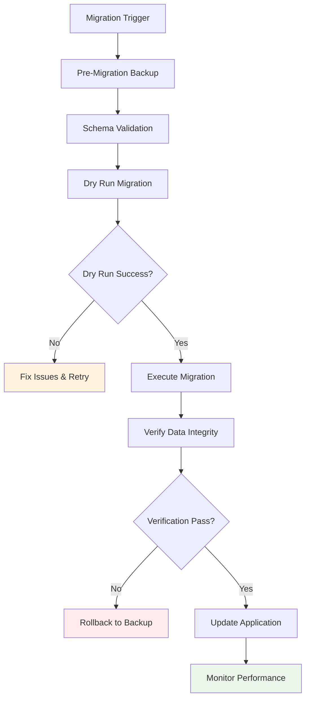

This data flow architecture ensures reliable, secure, and performant data processing throughout the NextJS Stripe Payment Template, with proper error handling, caching strategies, and real-time updates where needed.